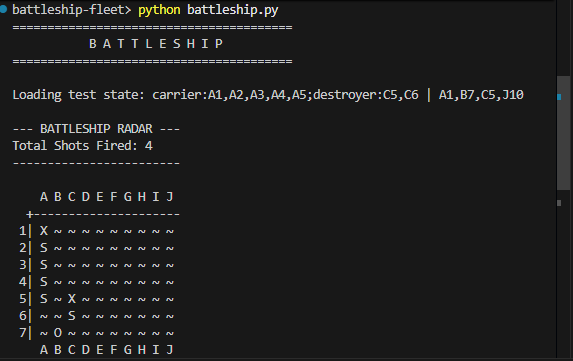

# **WE ARE GROUP 25**

Thato Mashifana / Nhluvuko Mlambu / Thabiso Mashifana / Tumelo Mawayi / Harry Mofoka

## Overview
This project handles the core game logic for a game of Battleship. It processes the state of the board, calculates valid moves, and evaluates the outcome of every shot fired.

## Game
<p align="center">
  
</p>


### Flowchart Diagram
<p align="center">
  
</p>

TeamWork and Contributions:

Team Lead: Tumelo Mawayi
Co-Lead: Thato Mashifana
GitHub Collab: Thato Mashifana, Harry Mofoka and Thabiso Mashifana
Program Logic Lead: Harry Mofoka and Nhlovuko Mlandu

## Core Game Logic `battleship.py`

Thabiso Mashifana: Game Logic and Implementation
Tumelo Mawayi: Data Flow Chart (Pre Code)
Thato Mashifana: Parse State and Testing
Harry Mofoka: Shots Fired State Checker Functions
Nhlvuko Mlandu: Game State Checker Functions

### How to Run the Tests
To run the tests and verify the game logic, run the following command in your terminal:

<p align="center">
  
</p>

```bash
python -m unittest test_battleship.py
python battleship.py


