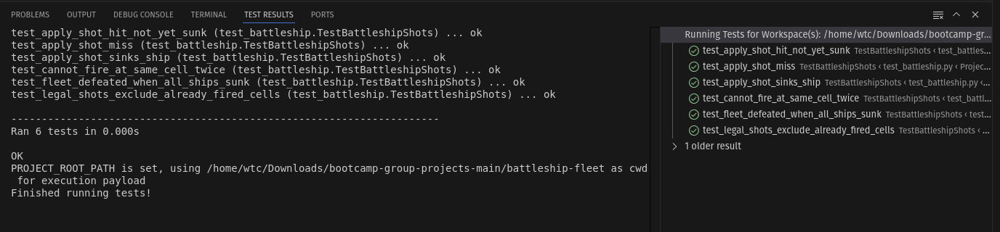

# **WE ARE GROUP 25**

Thato Mashifana / Nhluvuko Mlambu / Thabiso Mashifana / Tumelo Mawayi / Harry Mofoka

## Overview
This project handles the core game logic for a game of Battleship. It processes the state of the board, calculates valid moves, and evaluates the outcome of every shot fired.

## Core Game Logic `battleship.py`

### How to Run the Tests
To run the tests and verify the game logic, run the following command in your terminal:

<p align="center">
  
</p>

```bash
python -m unittest test_battleship.py
